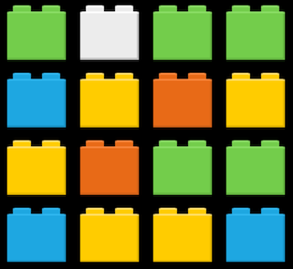
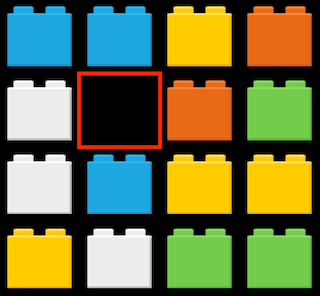
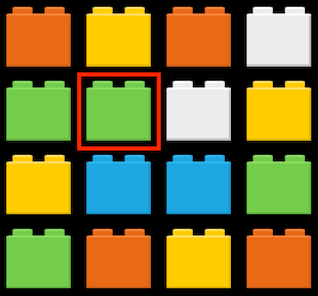
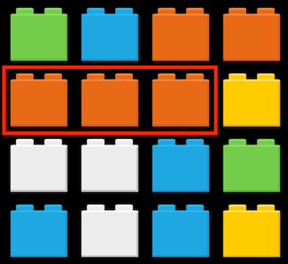

# Emthree
Emthree is a match three engine for Defold.


# Setup
## Add project dependencies
You can use Emthree in your own project by adding this project as a [Defold library dependency](http://www.defold.com/manuals/libraries/). Open your game.project file and in the dependencies field under project add:

https://github.com/britzl/emthree/archive/master.zip

Or point to the ZIP file of a [specific release](https://github.com/britzl/emthree/releases).


# Examples
Two examples, one basic and one a bit more advanced are available to try here:

* https://britzl.github.io/Emthree/


# Usage

## Terminology
This documentation uses a number of different concepts to describe the functionality of Emthree. Please refer to the list below to better understand how Emthree works.

### Board
A grid of slots where the game is played.



### Slot
A position on the board. A slot can hold a block.



### Block
A block represents an element in a slot on the board. It could be fish, candy, cakes or something else, fitting the theme of the game. Blocks will fall if there are free slots below them. Blocks have a color and an optional type.



### Blocker
A blocker represents an element in a slot on the board that is static. It will not fall and it will stop blocks from falling any further. Blockers have an optional type.

### Spawner
A spawner represents an element in a slot on the board that creates/spawns blocks. It will not fall and it will stop blocks from falling any further. Spawners have an optional type.

### Match
Three or more blocks of the same color is considered a match.



### Stable Board
A board is considered stable when the board doesn't contain any matches and all slots are filled with blocks.


## EmthreeAPI - The basics

### emthree.create_board(width, height, block_size)
Create an Emthree board of the specified dimensions

**PARAMETERS**
* ```width``` (number) - Board width in blocks
* ```height``` (number) - Board height in blocks
* ```block_size``` (number) - Size of a block
* ```config``` (table) - Optional table with board configuration values

The `config` table can contain the following values:
* ```collapse_duration``` - Time in seconds for the collapse animation
* ```slide_direction``` - Direction to slide blocks in when collapsing the board after removing blocks. Can be one of `emthree.SLIDE_UP`, `emthree.SLIDE_DOWN`, `emthree.SLIDE_LEFT` or `emthree.SLIDE_RIGHT`
* ```slide_easing``` - Easing function to apply when sliding blocks. Any of the `go.EASING_*` constants.

**RETURN**
* ```board``` (table) - A representation of the board, complete with a 2D array of blocks


### emthree.stabilize(board, callback)
Stabilize the board. This will search through the board for any matches, remove these and the spawn new blocks. This process will be repeated until there are no matches to remove or new blocks to spawn. When the board is stable it will invoke the function specified by `emthree.on_stabilized`.

**PARAMETERS**
* ```board``` (table) - The board to stabilize
* ```callback``` (function) - Optional function to call when the board is stable


### emthree.on_input(board, action)
Pass user input to the board to detect interaction with the blocks. Only touch/click events with a state of `pressed` or `released` must be sent. When a block is selected through a click Emthree will send an `emthree.SELECT` message to the game object representing the block. When a block is deselected an `emthree.RESET` message is sent. Emthree will release input focus while processing input and acquire it again when the board is stable.

**PARAMETERS**
* ```board``` (table) - The board to apply the input to
* ```action``` (table) - The action table received from the engine lifecycle function on_input. Only pass on touch/click events where `pressed` or `released` is true.


## EmthreeAPI - Slot access

### emthreee.iterate_blocks(board, filter_fn)
Return an iterator function that can be used to iterate all blocks on the board. The blocks can optionally be filtered by the iterator to only return blocks that match certain criteria

**PARAMETERS**
* ```board``` (table) - The board to iterate
* ```filter_fn``` (function) - A function that can be used to filter blocks. The function will receive the board, x and y position as arguments and must return true or false depending on if the block at that position should be returned or not.

**RETURN**
* ```fn``` (function) - The iterator function. The function will return a block.


### emthree.get_blocks(board, color)
Get all blocks of a certain color

**PARAMETERS**
* ```board``` (table) - The board to get blocks from
* ```color``` (any) - The color to search for

**RETURN**
* ```blocks``` (table) - A list of all blocks matching the specified color


### emthree.get_block(board, x, y)
Get the block at a specific position

**PARAMETERS**
* ```board``` (table) - The board to get the block from
* ```x``` (number) - Horizontal position
* ```y``` (number) - Vertical position

**RETURN**
* ```block``` (table) - The block or nil if position is outside board


### emthree.on_board(board, x, y)
Check if a position is on the board

**PARAMETERS**
* ```board``` (table) - The board to check position on
* ```x``` (number) - The horizontal slot position
* ```y``` (number) - The vertical slot position

**RETURN**
* ```on_board``` (boolean) - True if the position is on the board


### emthree.is_block(board, x, y)
Check if the content of a slot is a block

**PARAMETERS**
* ```board``` (table) - The board to check
* ```x``` (number) - Horizontal position
* ```y``` (number) - Vertical position

**RETURN**
* ```result``` (boolean) - True if there is a block in the slot


### emthree.is_blocker(board, x, y)
Check if the content of a slot is a blocker

**PARAMETERS**
* ```board``` (table) - The board to check
* ```x``` (number) - Horizontal position
* ```y``` (number) - Vertical position

**RETURN**
* ```result``` (boolean) - True if there is a blocker in the slot


### emthree.is_spawner(board, x, y)
Check if the content of a slot is a spawner

**PARAMETERS**
* ```board``` (table) - The board to check
* ```x``` (number) - Horizontal position
* ```y``` (number) - Vertical position

**RETURN**
* ```result``` (boolean) - True if there is a spawner in the slot


### emthree.is_empty(board, x, y)
Check if a slot is empty

**PARAMETERS**
* ```board``` (table) - The board to check
* ```x``` (number) - Horizontal position
* ```y``` (number) - Vertical position

**RETURN**
* ```result``` (boolean) - True if the slot is empty


## EmthreeAPI - Remove, change and create blocks

### emthree.remove_block(board, block)
Remove a block from the board. This will invoke the function specified by `emthree.on_block_removed()`. This will also post an `emthree.REMOVE` message to the game object representing the block.

**PARAMETERS**
* ```board``` (table) - The board to remove block from
* ```block``` (table) - The block to remove


### emthree.remove_blocks(board, blocks)
Remove a list of blocks. Will repeatedly call `emthree.remove_block()`.

**PARAMETERS**
* ```board``` (table) - The board to remove blocks from
* ```blocks``` (table) - The blocks to remove


### emthree.change_block(block, type, color)
Change a block on the board from one type and color to another. This will post an `emthree.CHANGE` message to the game object representing the block.

**PARAMETERS**
* ```block``` (table) - The block to change
* ```type``` (any) - The type to change to
* ```color``` (any) - The color to change to


### emthree.create_block(board, x, y, type, color)
Create a new block on the board. This will call the function passed to `emthree.on_create_block()`.

**PARAMETERS**
* ```board``` (table) - The board to create block on
* ```x``` (number) - The horizontal slot position of the block
* ```y``` (number) - The vertical slot position of the block
* ```type``` (any) - The type of the block
* ```color``` (any) - The color of the block

**RETURN**
* ```block``` (table) - The created block


### emthree.create_blocker(board, x, y, type)
Create a new blocker on the board. This will call the function passed to `emthree.on_create_blocker()``

**PARAMETERS**
* ```board``` (table) - The board to create blocker on
* ```x``` (number) - The horizontal slot position of the blocker
* ```y``` (number) - The vertical slot position of the blocker
* ```type``` (any) - The type of the blocker

**RETURN**
* ```blocker``` (table) - The created blocker


### emthree.create_spawner(board, x, y, type)
Create a new spawner on the board. This will call the function passed to `emthree.on_create_spawner()``

**PARAMETERS**
* ```board``` (table) - The board to create spawner on
* ```x``` (number) - The horizontal slot position of the spawner
* ```y``` (number) - The vertical slot position of the spawner
* ```type``` (any) - The type of the spawner

**RETURN**
* ```blocker``` (table) - The created spawner


### emthree.fill_board(board)
Fill the board with blocks. This will call the function passed to `emthree.on_create_block()`.

**PARAMETERS**
* ```board``` (table) - The board to fill with blocks


## EmthreeAPI - Callbacks

### emthree.on_create_block(board, fn)
Set a function to be called whenever a block is to be created on the board. The function is expected to spawn a game object and return the game object id.

**PARAMETERS**
* ```board``` (table) - The board that will notify when a new block needs to be created
* ```fn``` (function) - The function to call when a block should be created

The function must accept and return the following:

**PARAMETERS**
* ```board``` (table) - The board where the block should be created
* ```position``` (vector3) - Position of the block to create
* ```type``` (any) - The block type, can be nil
* ```color``` (any) - The color of the block

**RETURN**
* ```id``` (hash) - Id of the created game object
* ```type``` (any) - Type of the created block
* ```color``` (any) - Color of the created block


### emthree.on_create_blocker(board, fn)
Set a function to be called whenever a blocker is to be created on the board. The function is expected to spawn a game object and return the game object id.

**PARAMETERS**
* ```board``` (table) - The board that will notify when a new blocker needs to be created
* ```fn``` (function) - The function to call when a blocker should be created

The function must accept and return the following:

**PARAMETERS**
* ```board``` (table) - The board where the blocker should be created
* ```position``` (vector3) - Position of the blocker to create
* ```type``` (any) - The blocker type, can be nil

**RETURN**
* ```id``` (hash) - Id of the created game object
* ```type``` (any) - Type of the created blocker


### emthree.on_create_spawner(board, fn)
Set a function to be called whenever a spawner is to be created on the board. The function is expected to spawn a game object and return the game object id.

**PARAMETERS**
* ```board``` (table) - The board that will notify when a new spawner needs to be created
* ```fn``` (function) - The function to call when a spawner should be created

The function must accept and return the following:

**PARAMETERS**
* ```board``` (table) - The board where the spawner should be created
* ```position``` (vector3) - Position of the spawner to create
* ```type``` (any) - The spawner type, can be nil

**RETURN**
* ```id``` (hash) - Id of the created game object
* ```type``` (any) - Type of the created spawner


### emthree.on_match(board, fn)
Set a function to be called whenever a match on the board is detected. Use this callback to remove the blocks involved in the match and optionally also create new blocks based on the match. The default implementation will remove the blocks and do nothing else.

**PARAMETERS**
* ```board``` (table) - The board that will notify when a match is detected
* ```fn``` (function) - The function to call when a match is detected.

The function must accept the following arguments:

**PARAMETERS**
* ```board``` (table) - The board where the match was detected
* ```block``` (table) - A block that is part of the match
* ```horisontal_neighbors``` (table) - A list of horizontal neighboring blocks that are part of the match
* ```vertical_neighbors``` (table) - A list of vertical neighboring blocks that are part of the match


### emthree.on_block_removed(board, fn)
Set a function to be called whenever a block is removed. Use this callback to trigger effects on special blocks.

**PARAMETERS**
* ```board``` (table) - The board that will notify when a block is removed
* ```fn``` (function) - The function to call when a block is removed. The function will receive `board` and `block` as arguments.


### emthree.on_stabilized(board, fn)
Set a function to be called when the board is stable.

**PARAMETERS**
* ```board``` (table) - The board that will notify when stable
* ```fn``` (function) - The function to call when the board is stable. The function will receive `board` as arguments.


### emthree.on_swap(board, fn)
Set a function to be called whenever a two blocks have swapped places based on user input. Use this to trigger effects when certain types of blocks were swapped.

**PARAMETERS**
* ```board``` (table) - The board where swaps will be notified
* ```fn``` (function) - The function to call when a swap is made. The function is expected to take `board`, `slot1` and `slot2` as arguments and return true if swap resulted in any changes on the board.


## EmthreeAPI - Utility functions

### emthree.screen_to_slot(board, x, y)
Get the slot at a screen position.

**PARAMETERS**
* ```board``` (table) - The board to get the slot from
* ```x``` (number) - Horizontal screen position (pixels)
* ```y``` (number) - Vertical screen position (pixels)

**RETURN**
* ```x``` (number) - Horizontal pixel position
* ```y``` (number) - Vertical pixel position


### emthree.slot_to_screen(board, x, y)
Get the screen coordinates of a slot.

**PARAMETERS**
* ```board``` (table) - The board to get the slot from
* ```x``` (number) - Horizontal slot position
* ```y``` (number) - Vertical slot position

**RETURN**
* ```x``` (number) - Horizontal slot position
* ```y``` (number) - Vertical slot position


## EmthreeAPI - Messages

### emthree.REMOVE
Message sent to the game object representing a block on the board when it is to be removed.


### emthree.CHANGE
Message sent to the game object representing a block on the board when it is to change color and/or type.

**PARAMETERS**
* ```color``` (any) - The color to change to
* ```type``` (any) - The type to change to


### emthree.SELECT
Message sent to the game object representing a block on the board when it is selected.


### emthree.RESET
Message sent to the game object representing a block on the board when it is deselected.
